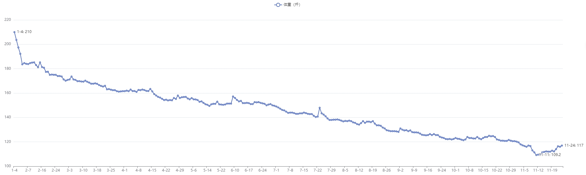

# 《热辣滚烫》每日体重数据可视化实战项目

## 1 相关背景

本项目完全处于个人兴趣爱好，根据 2024 年贾玲执导并主演的贺岁大片《热辣滚烫》（英文名：`YOLO`）中片尾给出的贾玲每日体重数据整理而来。项目只完成了一半，因为对数据可视化的效果不太熟悉，只借助 `GitHub Copilot Chat` 做了一个简单的静态曲线图。实际需求是通过这些原始数据（日期、体重和备注），利用一些常见的第三方 `JavaScript` 库做一个交互式的动画效果。

## 2 具体需求

首次加载页面时，先展示一个整体的曲线（已完成），然后从起点处渲染出一个高亮的小圆点（比如橙黄色），以匀速沿着这条减肥曲线移动。每当小圆点通过有备注内容的数据点时，则在曲线上自动渲染出一个文本框，展示该备注内容。然后小圆点略作停顿（如 `0.8` 秒），再继续恢复移动，直至走到最后一个数据点，完成整个动画。

相关原始数据的截屏（共 31 张）和整理出的 `CSV` 格式数据已经分别上传到 `raw_data` 和 `data` 文件夹内。原始版本默认使用 `Echarts`（`v5.4.3` 版）。也可以根据需要选择其他 `JS` 库实现上述效果。

目前的效果图如下：

## 3 运行方式

导入 `VSCode` 后，通过 `Live Server` 运行即可（URL：http://127.0.0.1:5500/index.html）。

